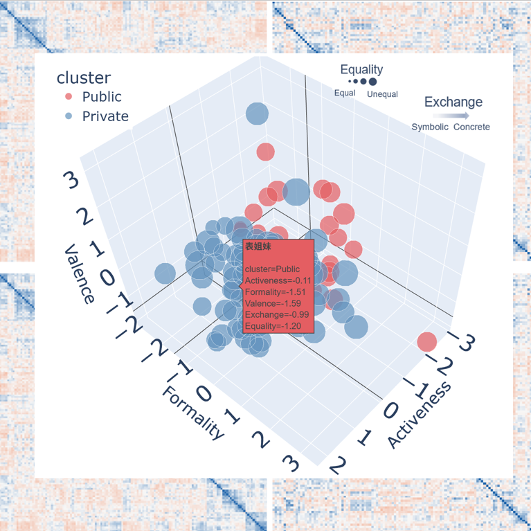
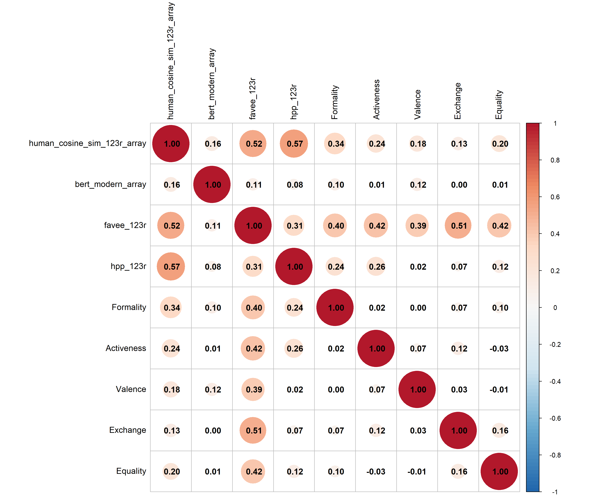

# The Conceptual Structure of Chinese Kinship: A Modern-Ancient Comparison

> **Research Project** | **Advisor:** Prof. Duan Jipeng | **Ningbo University**

## 📖 Overview
This repository contains the computational pipeline and analysis code for my independent research project: *"Mapping the Semantic Drift of Chinese Kinship Terms across 3000 Years."*

This project bridges **Computational Linguistics** and **Social Cognition** by comparing human mental representations with high-dimensional embeddings from Large Language Models (LLMs). We investigate how the semantic geometry of kinship terms (e.g., *Father*, *Maternal Uncle*) has evolved from ancient texts to modern usage.

## 🚀 Key Features & Pipeline
The analysis framework integrates **Representational Similarity Analysis (RSA)** to benchmark behavioral data against artificial neural networks.

### 1. Behavioral Data Acquisition
- Collected similarity ratings and kinship structure data from **N=160** human participants.
- Constructed human-based **Representational Dissimilarity Matrices (RDMs)** based on cognitive dimensions (generation, gender, lineage).

### 2. Computational Modeling (LLMs)
- **Context Generation:** Automated prompt engineering using **DeepSeek-V3**.
- **Embedding Extraction:** Extracted contextualized embeddings from:
  - **Modern Models:** `Chinese-RoBERTa-wwm`, `BERT-base-chinese`
  - **Ancient Models:** `SikuBERT` (trained on Siku Quanshu) / `Guwen-BERT`
- **Dimensionality Reduction:** Applied **t-SNE** and **MDS** to visualize the semantic manifolds.

### 3. Neural-AI Alignment (RSA)
- Calculated the Spearman correlation between Human RDMs and Model RDMs.
- Quantified the "alignment score" to measure how well LLMs capture the anthropological structure of kinship.
  
## 📊 Some of Results 

### 1. Semantic Manifold of Kinship Terms

  

**Figure 1.** A five-dimensional visualization of the semantic manifold underlying Chinese kinship terms. 
Three continuous social-cognitive dimensions — **Formality**, **Activeness**, and **Valence** — are 
mapped onto 3D spatial coordinates, while **Equality** is encoded via marker size and **Exchange** 
(symbolic ↔ concrete) via the radial color gradient. Points are color-coded by cluster membership 
(**Public** vs. **Private** discourse contexts), revealing a systematic dissociation in the semantic 
organization of kinship terms across social domains. The background heatmaps depict the corresponding 
Representational Dissimilarity Matrices (RDMs) used to derive this clustering structure.

### 2. Human-Model Representational Alignment (Ceiling Performance)

  

**Figure 2.** Spearman correlation matrix quantifying the alignment between human similarity judgments 
(`human_cosine_sim`), LLM-derived embedding similarities (`bert_modern_array`, `favee_123r`, `hpp_123r`), 
and the five social-cognitive dimensions (Formality, Activeness, Valence, Exchange, Equality). This 
analysis establishes an empirical **ceiling** for evaluating how well current language models capture 
the anthropological and cognitive structure embedded in human kinship term representations.
